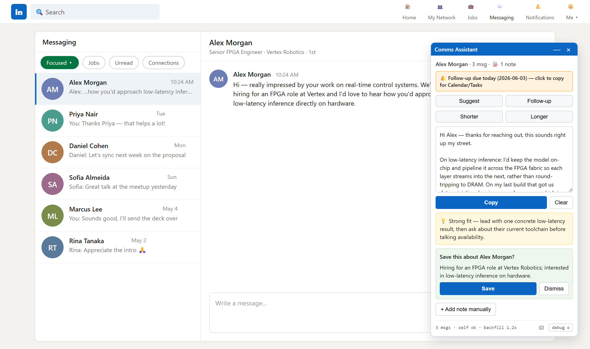
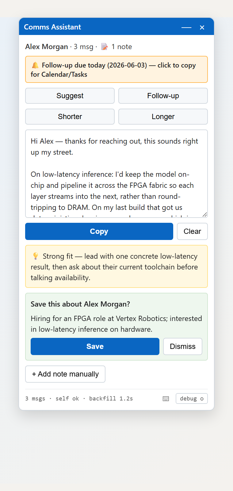

# Comms Assistant

**Reply on LinkedIn in your own voice — without staring at a blank box.**

Comms Assistant is a Chrome extension paired with a small local server that reads the LinkedIn conversation you're looking at, understands who you're talking to, and drafts a reply that actually sounds like *you*. Everything runs on your own machine. Your messages, your contacts, and your writing style never leave your computer.

It's built for people who send a lot of LinkedIn messages — recruiters, founders, job seekers, networkers — and want a thoughtful first draft in seconds instead of a generic template.



> *The panel, conversation, and contact above are a fictional demo — no real messages are shown.*

---

## Why it's different

- **It writes like you, not like a robot.** You give it a short profile of your own writing style, and every suggestion is matched to that voice.
- **It remembers people.** Notes you confirm about a contact — and the details from their LinkedIn profile — are saved locally and used to make future replies sharper.
- **It stays private by design.** No cloud account, no data collection. The AI runs through your own local setup, and your conversation history is yours alone.
- **It's safe against trickery.** Message content and profile text are treated as untrusted, so a contact can't sneak hidden instructions into a reply.

---

## Features

- **One-click reply suggestions** in a floating, draggable panel that sits right on top of LinkedIn.
- **Four reply modes** — Suggest a fresh reply, write a Follow-up to revive a quiet thread, or make the current draft Shorter or Longer.
- **Keyboard shortcuts** — `Alt+S` Suggest, `Alt+F` Follow-up, `Alt+H` Shorter, `Alt+L` Longer, `Alt+C` Copy.
- **Contact memory** — confirm a fact about someone with one click; it's remembered next time.
- **Profile enrichment** — automatically reads a contact's role, company, and background to ground each reply.
- **Follow-up reminders** — when a conversation suggests "check back in a few days," you get a gentle nudge you can copy into your calendar.
- **Bring your own AI** — use the local `gemini` CLI, or point it at any OpenAI-compatible service (OpenAI, OpenRouter, Ollama, LM Studio, and more).
- **Copy, never auto-send** — you always review and edit before anything is sent.

<p align="center">
  
</p>

---

## Getting started

**You'll need:** [Node.js](https://nodejs.org) 18+, Google Chrome, and one AI option — the local `gemini` CLI (signed in), or an API key for any OpenAI-compatible service (OpenAI, OpenRouter, Ollama, LM Studio, …).

### Quick start

```bash
git clone https://github.com/Vaidurya-s/Communication_Assistant.git
cd Communication_Assistant
npm run setup        # installs deps, builds the extension, scaffolds your config
```

Then four short steps:

1. **Pick your AI** — edit `backend/.env`. Defaults to the local `gemini` CLI (no key); set `LLM_PROVIDER=openai-compat` and your `OPENAI_API_KEY` to use an API instead.
2. **Teach it your voice** — drop a few of your real sent messages into `voice_profile/raw_corpus/` and run `npm run init-voice`, or hand-edit `voice_profile/strategy_analysis.md`.
3. **Start the backend** — `npm start` (runs at `http://localhost:8000`).
4. **Load the extension** — `chrome://extensions` → Developer mode → **Load unpacked** → `extension/dist`.

Then open a LinkedIn thread, set your display name once via the toolbar icon, and click **Suggest** — edit, **Copy**, paste.

**→ Full walkthrough, AI options, and troubleshooting: [SETUP.md](SETUP.md).**

---

## On the roadmap

- Support for more platforms — WhatsApp, Gmail, and others.
- Optional one-click calendar and task reminders for follow-ups.
- Smarter memory that learns patterns across all your conversations.
- A guided first-run setup so getting started is even quicker.

---

## Contributing & feedback

This is an active project, and thoughtful input is always welcome — whether it's a bug report, a feature idea, or a pull request. If something feels confusing or could work better, that's exactly the kind of feedback that helps most. Open an issue or start a discussion, and let's make replying on LinkedIn feel effortless.
