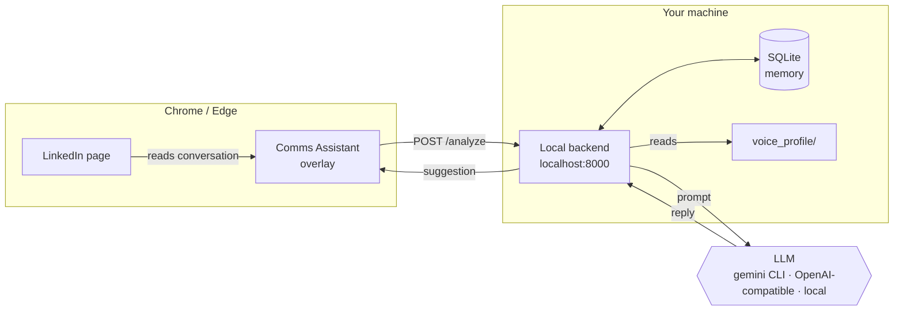
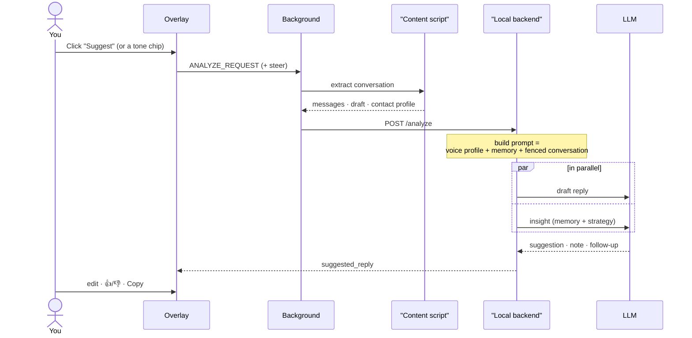
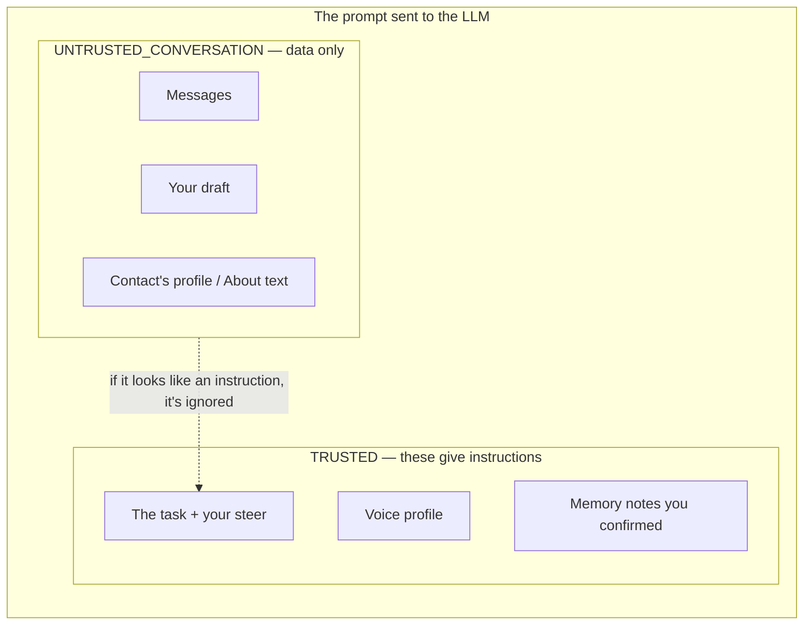
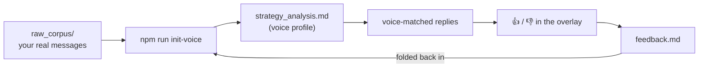

# Comms Assistant — demo video plan

A 2-minute storyboard plus the diagrams to show on screen. The Mermaid diagrams
render inline on GitHub (and in any Mermaid-aware viewer / the
[Mermaid live editor](https://mermaid.live)), so you can screen-share this file
directly or grab the rendered diagrams for slides.

**One-line pitch:** _Draft LinkedIn replies in your own voice, with a private AI
that runs entirely on your own machine._

---

## 🎬 2-minute storyboard (120s)

| Time | On screen | Say (≈) |
|------|-----------|---------|
| **0:00–0:12** Hook | Overlay on a LinkedIn thread; click **Suggest**, reply appears | "This is Comms Assistant. It drafts LinkedIn replies in *my own voice* — and it all runs on my own laptop, not the cloud." |
| **0:12–0:30** Problem | Blank reply box, cursor blinking | "Replying well is slow, generic AI sounds like a robot, and I didn't want to upload my private conversations to anyone's server." |
| **0:30–1:25** Live demo | Real extension (see beat list below) | walk the demo briskly, narrating each move |
| **1:25–1:45** Under the hood + privacy | Split: panel + terminal at `localhost:8000` + the **Architecture** diagram | "A Chrome extension talks to a small server on my machine. It blends my voice profile with what it remembers, then calls an AI — local or any provider I plug in. My messages never leave my laptop." |
| **1:45–2:00** Experiment → tool + close | Terminal: `npm run setup` / `npm run doctor` all-green, then the overlay | "One command to set up, a doctor command to check it's healthy, and it packages straight for the Chrome store. Private by design, and ready to share." |

### The demo beats (0:30–1:25, ~55s — rehearse this)

1. **Open a thread** → panel auto-appears. _"It reads the conversation in front of me."_
2. **Suggest** (Alt+S) → voice-matched reply. _"Drafted from a profile of how I write."_
3. **Tone chip — Warmer** (or type a steer) → reply visibly changes. _"I can steer it live — warmer, shorter, more formal."_
4. **👍 / 👎** → _"I rate it, and that feedback feeds back into my voice profile, so it improves over time."_
5. **Memory card → Save**, then the 🔔 **follow-up chip**. _"It remembers people and reminds me to circle back."_
6. **Copy** → paste into LinkedIn. _"I always review before sending — nothing is automated."_

### Recording tips

- Use a **throwaway / demo thread** so nothing private is on screen.
- Use the **Alt shortcuts** (Alt+S / +H / +L / +R / +C) for snappy cuts.
- Hide the bookmarks bar and notifications; record at 1080p.
- Keep total narration ≈ 150 words — you'll land near 2:00 naturally.
- If a beat runs long, cut to a clean still from `docs/images/`.

---

## 🧩 Visualizations

### 1. Architecture — three parts, all on your machine

_The only thing that can leave your machine is the AI call you choose — and with
the local `gemini` CLI or a local model, nothing leaves at all._

### 2. One reply, traced end to end

### 3. Trust boundary — why a malicious message can't hijack a reply

_Conversation and profile text are fenced as data; only the voice profile,
confirmed memory, and your own steer act as instructions._

### 4. The voice loop — it learns how you write, and keeps improving

---

## Feature highlights to name-drop

- **Your voice** — distilled from your real messages (`init-voice`), improved by 👍/👎.
- **Steer + tones** — warmer / direct / formal / decline, or free-form, on the fly.
- **Remembers people** — confirmed notes + LinkedIn profile enrichment.
- **Follow-up nudges** — never let a thread go cold.
- **Bring your own AI** — local `gemini`, or any OpenAI-compatible API.
- **Private by design** — local backend, untrusted-content fencing, copy-never-send.
- **Easy to run** — `npm run setup`, `npm run doctor`, `npm run package:extension`.

> Tip: to export any diagram as an image for slides, paste its code block into
> [mermaid.live](https://mermaid.live) and download the PNG/SVG.
